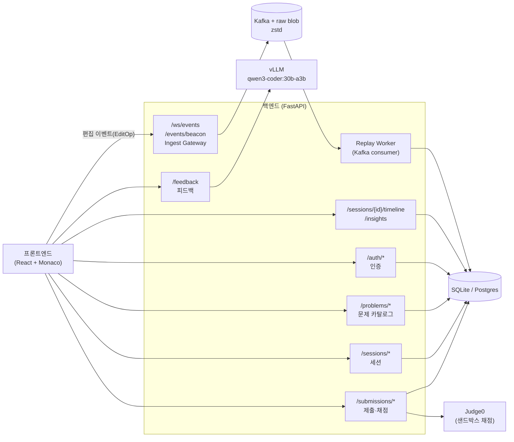

# LastDance

## 팀원

| 이름 | GitHub | 역할 |
|---|---|---|
| 이재준 | dannyiscard | 백엔드 |
| 임유빈 | lunar-yoobin | 프런트엔드 |

---

## 기획안

> 프로젝트 주제, 목적, 핵심 기능, 예상 사용자, 팀원별 역할 등 정리

- **주제:** 액티브 PS 피드백 플랫폼
- **목적:** 사용자들로 하여금 본인의 PS 문제풀이의 피드백을 받을 수 있다.
- **핵심 기능:** 문제 조회, 문제 풀이 및 채점, 코드 피드백 기능
- **예상 사용자:** 코딩테스트를 준비하는데 단순 채점 서비스만으로 부족하다고 생각하는 사람들

---

## 기능 명세서

> 구현할 기능을 사용자 관점에서 정리하고, 필수 기능과 선택 기능을 구분

### 필수 기능

- [이메일을 통한 회원가입 및 로그인]
- [PS 문제들에 대한 접근 및 풀이]
- [내가 푼 문제들에 대한 기록]
- [내 풀이에 대한 자세한 사후 피드백]

### 선택 기능

## IA 및 화면 설계서

> 서비스의 전체 페이지 구조와 페이지 간 이동 흐름; 각 페이지의 주요 UI 구성, 입력 요소, 버튼, 사용자 행동 흐름 등을 간단한 와이어프레임 형태로 정리

<!-- Figma 링크 또는 이미지 첨부 -->

---

## DB 스키마

> 전체 DDL과 컬럼별 설명은 [`docs/db-schema.md`](docs/db-schema.md) 참고. SQLite(`backend/app.db`, `DATABASE_URL` 미설정 시 기본값) + SQLAlchemy `Base.metadata.create_all()`로 생성됩니다.
> 아래 관계선은 **논리적 관계**입니다 — 실제 테이블에는 FK 제약을 걸지 않았습니다. 세션 테이블 이름이 `submissions`, 채점 기록이 `judge_submissions`인 점에 주의(세션 1개 : 제출 N개).

```mermaid
erDiagram
    users ||--o{ refresh_tokens : "user_id"
    users ||--o{ submissions : "user_id"
    users ||--o{ judge_submissions : "user_id"
    users ||--|| summaries : "user_id"
    problems ||--o{ submissions : "problem_id"
    problems ||--o{ judge_submissions : "problem_id"
    problems ||--o{ problem_feedback_insights : "problem_id"
    submissions ||--o{ judge_submissions : "session_id"
    submissions ||--|| ingest_session_states : "sid"
    submissions ||--|| session_summaries : "sid"
    submissions ||--o{ code_commits : "sid"
    submissions ||--o{ session_segments : "sid"
    submissions ||--o{ problem_feedback_insights : "sid"
    submissions ||--o{ feedbacks : "session_id"

    users {
        TEXT user_id PK "uuid4"
        TEXT email UK
        TEXT nickname
        TEXT hashed_password "bcrypt"
        TEXT profile_img "nullable"
        TIMESTAMP account_created
        TEXT introduction
    }
    refresh_tokens {
        TEXT refresh_token PK
        TEXT user_id FK
        TIMESTAMP expires_at "발급 +14일"
    }
    problems {
        INTEGER problem_id PK "API에 그대로 노출"
        TEXT title
        TEXT statement
        TEXT constraints
        JSON examples "input/output 배열"
        TEXT difficulty "A(쉬움)~G(어려움), nullable"
        TEXT source "codenet_atcoder"
        TEXT testcase_dir "내부 채점용, 비노출"
    }
    submissions {
        TEXT session_id PK "세션 라이프사이클"
        INTEGER problem_id FK
        TEXT user_id FK
        TEXT language "제출/종료 시 채워짐"
        TIMESTAMP started_at
        TIMESTAMP ended_at
        TEXT final_status "NULL(active)|solved|abandoned"
    }
    judge_submissions {
        TEXT submission_id PK "채점 시도 1건"
        TEXT session_id FK
        INTEGER problem_id FK
        TEXT user_id FK
        TEXT language
        TEXT code
        TEXT status "pending|judged"
        TEXT verdict "AC|WA|TLE|RE|CE"
        INTEGER runtime_ms
        INTEGER memory_kb
        TIMESTAMP submitted_at
    }
    ingest_session_states {
        TEXT sid PK
        TEXT user_id
        INTEGER problem_id
        TEXT lang
        BOOLEAN seq_gap_detected "true면 degraded"
        BOOLEAN ended "워커 멱등 처리용"
        TIMESTAMP created_at
    }
    session_summaries {
        TEXT sid PK "세션당 1행"
        TEXT user_id
        INTEGER problem_id
        TEXT analysis_level "full|degraded"
        INTEGER matcher_version "timeline_version"
        INTEGER total_ms
        INTEGER formation_ms "STALL_SUSPECT 합"
        INTEGER debug_ms "DEBUG_LOOP+HIGH_CHURN 합"
        INTEGER refine_ms "STEADY+BURST_WRITE 합"
        INTEGER keystroke_count
        INTEGER pause_total_ms
        INTEGER pause_count
        TIMESTAMP created_at
    }
    code_commits {
        INTEGER id PK
        TEXT sid FK
        INTEGER seq "UNIQUE(sid,seq)"
        TEXT kind "edit|submit"
        INTEGER t_ms
        INTEGER pause_before_ms "커밋 경계 5000ms"
        INTEGER duration_ms
        TEXT hunks_json "라인 diff"
        TEXT verdict "kind=submit일 때만"
        INTEGER lines_added
        INTEGER lines_deleted
        INTEGER churn_lines
        TEXT snapshot_hash "sha256 앞 16자"
        TEXT snapshot_text "제출/종료 커밋만"
        INTEGER timeline_version
    }
    session_segments {
        INTEGER id PK
        TEXT sid FK
        TEXT seg_id "sg_0..."
        TEXT label "STALL_SUSPECT|HIGH_CHURN|DEBUG_LOOP|BURST_WRITE|STEADY"
        INTEGER commit_start_seq
        INTEGER commit_end_seq
        INTEGER t_start_ms "pause 시작 시점 포함"
        INTEGER t_end_ms
        INTEGER pause_ms
        INTEGER lines_touched
        INTEGER timeline_version
    }
    problem_feedback_insights {
        INTEGER id PK
        INTEGER problem_id FK
        TEXT sid FK
        TEXT user_id
        TEXT stage "정준 enum 9종"
        TEXT category "stall|churn|debug_loop|smooth"
        TEXT logic_label
        TEXT description
        TEXT severity "high|medium|low"
        INTEGER t_start_ms
        INTEGER t_end_ms
        TEXT advice
        TEXT analyzer_version
        TEXT status "valid|discarded"
    }
    feedbacks {
        TEXT feedback_id PK "uuid4"
        TEXT session_id FK
        TEXT text "LLM 생성 피드백"
        TEXT model_used
        TIMESTAMP generated_at
        TEXT rating "up|down|NULL"
    }
    summaries {
        TEXT user_id PK "미사용 스캐폴드"
        INTEGER total_submission
        INTEGER total_correct
        INTEGER total_wrong
    }
```

**레거시 테이블** (2026-07-30 git 타임라인 파이프라인 전환으로 **신규 기록 중단**, 과거 세션 조회 호환용으로만 유지): `pause_events`, `pivot_events`, `pattern_windows`, `unmatched_segments`, `ast_trees`.

**DB에 없는 것**: 원본 편집 이벤트(EditOp)는 DB가 아니라 Kafka(`keystroke-events`) → 로컬 디스크 raw blob(zstd, `RAW_STORE_DIR`)에 저장됩니다. DB에는 Replay Worker가 뽑아낸 파생 결과만 들어갑니다. 코드 전문은 개인정보 분리 원칙상 `session_summaries`에 저장하지 않습니다(`judge_submissions.code`는 제출 답안이라 별개).

---

## API 문서

> 전체 요청/응답 필드와 에러 코드는 [`docs/api-spec.md`](docs/api-spec.md), 프론트 요청 확장분은 [`docs/api-spec-additions.md`](docs/api-spec-additions.md) 참고. 서버 기동 후 `/docs`(Swagger UI)에서도 확인 가능합니다.
> 공통 에러 포맷 `{"error": {"code": "...", "message": "..."}}` · 날짜 ISO 8601 UTC · 인증 필요 엔드포인트는 `Authorization: Bearer {access_token}` 헤더 사용.
> 명세상 base URL은 `/api/v1`이지만 현재 백엔드는 프리픽스 없이 루트에 마운트되어 있습니다(`backend/app/main.py`).

### 인증 (`app/api/auth.py`)

| Method | Endpoint | 설명 | 요청 (Body) | 응답 |
|---|---|---|---|---|
| POST | `/auth/signup` | 회원가입 | `{"email": "example@example.com", "nickname": "example001", "password": "test12345"}` | 201 `{"user_id": "1", "nickname": "example001", "email": "example@example.com", "profile_img": null}` |
| POST | `/auth/login` | 로그인, access/refresh 토큰 발급 | `{"email": "example@example.com", "password": "test12345"}` | 200 `{"access_token": "<jwt>", "refresh_token": "<jwt>", "token_type": "bearer"}` |
| POST | `/auth/refresh` | refresh token으로 access token 재발급 | `{"refresh_token": "<jwt>"}` | 200 `{"access_token": "<jwt>", "token_type": "bearer"}` |
| POST | `/auth/logout` | 서버에 저장된 refresh token 폐기 | `{"refresh_token": "<jwt>"}` | 200 `{"message": "로그아웃 하였습니다."}` |
| GET | `/auth/me` | 현재 로그인 유저 조회 (인증 필요) | - | 200 `{"user_id": "1", "email": "...", "nickname": "...", "profile_img": null, "created_at": "2026-07-24T05:00:00Z"}` |

에러: 409 `EMAIL_TAKEN` / 401 `INVALID_CREDENTIALS` · `INVALID_REFRESH_TOKEN` · `UNAUTHORIZED`
토큰 만료: access 30분, refresh 14일 (`backend/app/util/security.py`)

### 문제 카탈로그 (`app/api/problem.py`)

| Method | Endpoint | 설명 | 요청 (Query) | 응답 |
|---|---|---|---|---|
| GET | `/problems` | 문제 목록 조회 | `?page=1&page_size=20&sort=difficulty_asc&difficulty=A,B,C&exclude_solved=true` | 200 `{"items": [{"problem_id": 1, "title": "Welcome to AtCoder", "difficulty": "C", "solved_at": null}], "page": 1, "page_size": 20, "total_count": 128}` |
| GET | `/problems/{problem_id}` | 문제 상세 조회 | - | 200 `{"problem_id": 1, "title": "...", "statement": "...", "constraints": "1<=a,b,c<=1000", "examples": [{"input": "1\n2 3\n", "output": "6"}], "difficulty": "C", "source": "codenet_atcoder", "time_limit": "1 sec", "memory_limit": "1024MB"}` |
| GET | `/problems/{problem_id}/stats` | 같은 문제를 푼 다른 사용자 대비 통계 | - | 200 `{"problem_id": 1, "metrics": [...]}` — 표본 `n<5` metric은 제외되어 `metrics`가 비면 "비교 불가" |

- `sort`: `difficulty_asc`(기본) \| `difficulty_desc` \| `problem_id` · `difficulty`: `A`(쉬움)~`G`(어려움) 다중 선택
- `exclude_solved`/`solved_at`은 인증된 요청일 때만 의미 있음 (비인증이면 무시/`null`)
- 에러: 404 `PROBLEM_NOT_FOUND`

### 세션 (`app/api/session.py`)

| Method | Endpoint | 설명 | 요청 | 응답 |
|---|---|---|---|---|
| POST | `/sessions` | 문제 풀이 세션 시작 | `{"problem_id": 1}` | 200 `{"session_id": "s_001", "problem_id": 1, "user_id": "u_001", "title": "...", "statement": "...", "examples": [...]}` |
| PATCH | `/sessions/{session_id}` | 세션 종료 처리 | `{"status": "solved", "language": "python3"}` | 200 `{"session_id": "s_001", "status": "solved"}` |
| GET | `/sessions/{session_id}` | 세션 상세 조회 | - | 200 `{"session_id": "s_001", "user_id": "1", "problem_id": 1, "language": "python3", "started_at": "...", "ended_at": null, "status": "active"}` |
| GET | `/users/me/sessions` | 현재 유저의 세션 목록 (인증 필요) | `?problem_id=1&status=active&page=1&page_size=20` | 200 `{"items": [{"session_id": "s_001", "problem_title": "...", "difficulty": "C", "status": "solved", "latest_verdict": "AC", ...}], "page": 1, "page_size": 20, "total_count": 37}` |

`status` enum: `active` \| `solved` \| `abandoned` · `/users/me/sessions` 기본 정렬 `started_at desc`

### 제출·채점 (`app/api/submission.py`)

| Method | Endpoint | 설명 | 요청 | 응답 |
|---|---|---|---|---|
| POST | `/submissions` | 코드 제출 + 즉시 채점(동기) | `{"session_id": "s_001", "problem_id": 1, "code": "print('hello')", "language": "python3"}` | 200 `{"submission_id": "sub_001", "status": "judged", "submitted_at": "2026-07-24T05:09:00Z"}` |
| GET | `/submissions/{submission_id}` | 제출 상세 (코드 원문 포함) | - | 200 `{"submission_id": "sub_001", "status": "judged", "verdict": "AC", "runtime_ms": 120, "memory_kb": 9600, "code": "...", "lang": "python3", "submitted_at": "..."}` |
| GET | `/submissions?session_id={id}` | 세션의 제출 이력 | - | 200 `{"items": [{"submission_id": "sub_001", "verdict": "AC", "submitted_at": "..."}]}` |

- 채점은 자체 호스팅 Judge0 경유(`backend/app/judge`). 테스트케이스는 `AtCoder_100/{source}/io/testcases.csv`를 idx 순으로 읽어 **첫 실패에서 중단**
- `verdict`: `AC` \| `WA` \| `TLE` \| `RE` \| `CE` \| `MLE` — `runtime_ms`/`memory_kb`는 AC일 때만 값이 있음
- `AC`면 세션이 자동으로 `solved` 종료, 그 외에는 세션을 `active`로 유지

### 실시간 이벤트 수집 (`app/api/ingest.py`)

| Method | Endpoint | 설명 | 요청 | 응답 |
|---|---|---|---|---|
| WS | `/ws/events?session_id={id}&token={access_token}` | 편집 로그 실시간 스트리밍 | Client→Server 5종 메시지 | Server→Client `ack` / `resume` / `error` |
| POST | `/events/beacon` | WS 불가/탭 종료 시 폴백 전송 | `edit.batch`와 동일 payload | 204 (본문 없음) |

- Client→Server: `session.start` · `edit.batch`(주 트래픽, 1000ms 주기 또는 버퍼 200개 플러시) · `session.heartbeat`(5초 주기, 90초 미수신 시 서버가 강제 종료) · `submission.mark` · `session.end`
- **EditOp**: `t`(상대 ms), `op`(0=insert, 1=delete), `pos`(코드포인트 오프셋), `len`, `txt`, `src`(`user` \| `autoindent` \| `autocomplete`)
- **멱등성 계약**: 서버가 `(sid, seq)`로 중복 제거(Redis, TTL 24h). 클라이언트는 `ack` 미수신 배치를 **동일 `seq`로** 재전송하고, seq를 재사용해 다른 내용을 보내면 안 됨

### 타임라인·인사이트 (`app/api/timeline.py`)

| Method | Endpoint | 설명 | 응답 |
|---|---|---|---|
| GET | `/sessions/{session_id}/timeline` | 커밋 로그 + 세그먼트 라벨 (타임라인 UI용) | 200 / 202(처리 중) / 404 |
| GET | `/sessions/{session_id}/insights` | 본인 세션의 논리 단계별 인사이트 | 200 (없으면 빈 배열) |

- 쿼리: `include_hunks`(기본 `true`), `include_snapshots`(기본 `false`)
- 세그먼트 라벨: `STALL_SUSPECT` \| `HIGH_CHURN` \| `DEBUG_LOOP` \| `BURST_WRITE` \| `STEADY` — **UI 문구 주의**: "어려웠던 구간"으로 표시해도 되는 건 `STALL_SUSPECT`뿐
- 인사이트 stage 정준 값 9종: `PROBLEM_UNDERSTANDING` · `APPROACH_DESIGN` · `CORE_LOGIC_DESIGN` · `SCAFFOLD_IMPLEMENTATION` · `CORE_IMPLEMENTATION` · `EDGE_CASE_HANDLING` · `DEBUG_LOGIC` · `DEBUG_TRIVIAL` · `OPTIMIZATION`
- 세션 종료(`session.end`) 후 Replay Worker가 비동기로 채우므로 프런트는 202→200 폴링. 타임라인은 LLM 없이도 항상 채워지고, 인사이트는 검증 통과분만 저장되어 빈 배열일 수 있음

### 피드백 (`app/api/feedback.py`)

| Method | Endpoint | 설명 | 요청 | 응답 |
|---|---|---|---|---|
| POST | `/feedback` | 세션에 대한 과정 기반 피드백 생성 | `{"session_id": "s_001"}` | 200 `{"feedback_id": "f_001", "text": "...", "model_used": "qwen3-coder:30b-a3b", "generated_at": "..."}` |
| GET | `/feedback?session_id={id}` | 이미 생성된 피드백 재조회 (생성 안 함) | - | 200 위와 동일 / 없으면 `null` |
| PATCH | `/feedback/{feedback_id}/rating` | 피드백 평가(👍👎) | `{"rating": "up"}` | 200 `{"feedback_id": "f_001", "rating": "up"}` |

프롬프트 근거는 본인 세션의 논리 단계별 인사이트 + 같은 문제를 푼 다른 사용자 비교군 집계. grounding 검증(입력에 없는 숫자 차단, 최대 2회 재시도) 실패 시 인사이트 기반 템플릿으로 폴백.

---

## 배포 결과물

> 접속 가능한 링크, 실행 방법, 주요 구현 내용

- **접속 방법:** https://codeback.madcamp-kaist.

---

## 회고 문서

> 개발 과정에서의 어려움, 해결 방법, 역할 분담, 다음에 개선할 점 (KPT 방법론 참고)

### Keep
- **Frontend와 Backend로 역할분담**: 역시 이게 편하다. 독립적으로 일도 할 수 있어서 좋았다.

### Problem
- **LLM 생성 코드들이 방대해지면서 코드 리뷰 힘들었음**: LLM이 코드를 잘 짜주지만, 가끔 주석 등을 너무 길고 현학적으로 작성해주고, 코드 자체를 지나치게 많이 짜주는 경우가 많아서 복잡한 작업의 코드 리뷰가 점점 힘들어졌다. 

### Try
- **Ponytail 적용**: 스킬 중 Ponytail이라는 스킬이 있는데, LLM이 코드를 번잡하지 않고 간결하게 핵심만 짜도록 파이프라인이 구성되어 있다. 나중에는 이를 직접 사용해서 개발 등을 해보고 싶다. 

---

